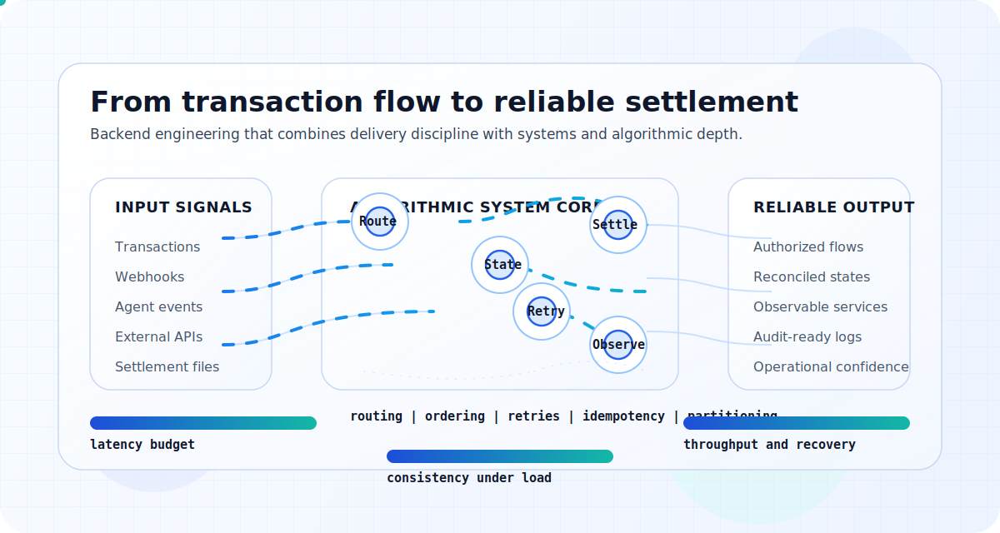

  

<h1 align="center">Frank Puma Chara</h1>

  <strong>Backend Engineer | Fintech, Payments, Distributed Systems</strong>

  I build production-grade backend systems for money movement, transaction flows, and high-integrity distributed platforms.

## Positioning

I work on backend systems where correctness, uptime, and operational clarity directly affect revenue and trust.

I adapt quickly to new domains, teams, and stacks, but adaptation is not the main value I bring.
My edge is designing and building from strong fundamentals in distributed systems, transactional integrity, event-driven architecture, and algorithmic reasoning.

## Commercial Value

- Turn business and product requirements into production-ready backend systems.
- Design payment and transfer flows with clear operational guarantees.
- Build integrations that survive retries, failures, asynchronous events, and real-world edge cases.
- Improve reliability, observability, and delivery confidence in critical systems.

## Research-Oriented Engineering

- I reason from first principles: data flow, state transitions, system boundaries, and failure modes.
- I care about idempotency, consistency, ordering, backpressure, latency budgets, and recovery paths.
- I use algorithmic thinking for routing, reconciliation, retries, scheduling, and high-volume event processing.
- I prefer explicit trade-offs over framework-driven complexity.

## Selected Domain Experience

- **Culqi**: payment systems and gateway-oriented transaction flows.
- **Kasnet**: agent networks, POS operations, and transactional infrastructure.
- **Ligo**: money transfer platforms and backend services for financial operations.

## Core Stack

- Node.js, TypeScript, NestJS
- Microservices and event-driven architecture
- Kafka, SQS, webhooks
- AWS: Lambda, EKS, S3, DynamoDB, RDS
- PostgreSQL, Redis, Elasticsearch
- Docker, Kubernetes, CI/CD
- Domain-Driven Design

## What I Am Building Now

- Distributed payment systems
- Event-driven backend platforms
- Production-grade engineering practices
- Reliable architectures that hold under scale and failure

## Contact

- LinkedIn: https://www.linkedin.com/in/frank-leonardo-puma-chara
- Portfolio: https://frankleonardopumachara.github.io/my-portfolio
